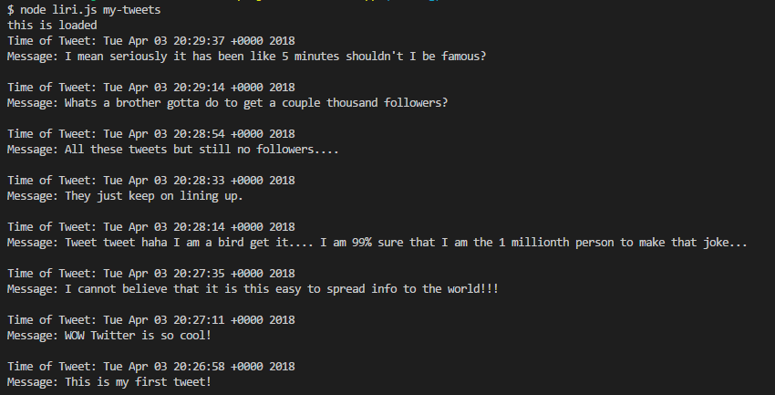
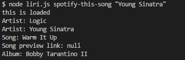
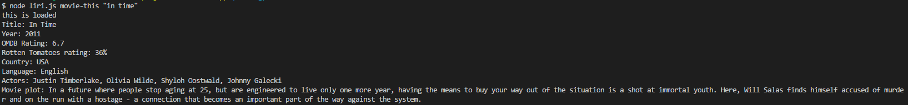
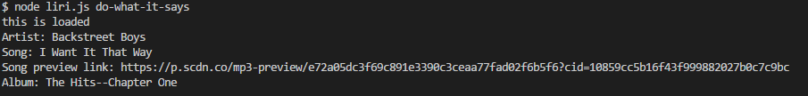

# liri-node-app

This is a personal assistant command line application that allows you to do many tasks. This personal assistant is called "Liri".

You can type in four different commands for Liri.

- node liri.js my-tweets
This will pull up to 20 of the most recent tweets from the account that you tell it to grab from, in this case it is my test account.

- node liri.js spotify-this-song "Song Name"
This will pull up information on the song that you would like to know more about, along with a link to listen to a preview.

- node liri.js movie-this "Movie Name"
This will allow you to search a movie name and then get back information such as the rating from multiple sources.

- node liri.js do-what-it-says
This command will grab the text from the "random.txt" file and run the command in it.

